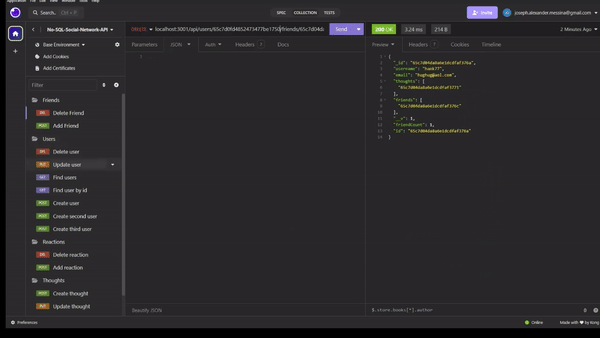
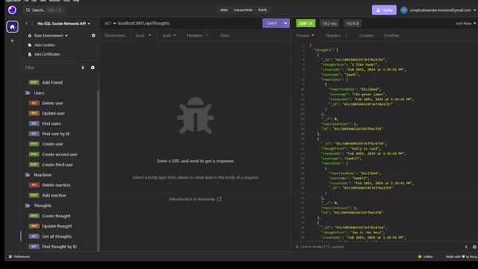
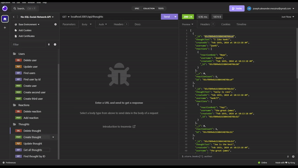

# Model-View-Controller-Exemplar
This is an exemplar for my use of NoSQL, specifically Mongoose. This is a backend application, so it has no GUI and can be viewed in its video <a href="./assets/No-SQL-Demo.mp4"> here</a>.

## Description

This project was an opportunity for me to learn about No SLQ, non-relational databases. Mongoose was very similar to MySQL in terms of how it functions, but with some key differences. Mongoose stored documents and subdocuments as objects, so navigating their data was more akin to interacting with traditional objects. I found this to be a handy feature since it required less direct set up. In MySQL, I had to define table relations in a separate file, while Mongoose just let me make ID references within a model. 

Mongoose also had some interesting tools to leverage that made coding much simpler. I used virtuals to help extract information that was not in my model (such as user friend counts) as well as to more cleanly format displayed data (such as when thoughts/reactions were created). I also thought Mongoose's use of database commands (like $set and $pull) made it very easy to manipulate data that was pulled from the database in the app's routes.

## Installation
This project requires the following packages to function:
1) "mongoose" which can be found at [https://mongoosejs.com/docs/7.x/index.html](https://mongoosejs.com/docs/7.x/index.html)
2) "express" which can be found at [https://expressjs.com/](https://expressjs.com/) 

## Usage
Once installed, the user needs to seed the database using the '''npm run seed''' command. After seeding, a user needs to start their npm server with the command '''npm start''. Then the user can navigate to "hostlocal:3001/api/{insert route here}" to see the backend route output using Insomnia [https://insomnia.rest/](https://insomnia.rest/). 

The following GIFs show this programs capabilities.
1) User Routes Demo  

2) Friends Routes Demo  

3) Thoughts Routes Demo 
 
4) Reactions Routes Demo 
 
 

## License
This product is protected by a [MIT License](http://choosealicense.com/licenses/mit).

## Contributing
I, Alex Messina, authored the majority of this code. Its layout and design was inspired by education resources. 

## Tests
No tests were prepared for this project. Error codes will be displayed by SQL if they occur and erratic behavior can be observed since the output is show via Insomnia.

## Questions
My GitHub username is [ExecutorKarthan](https://github.com/ExecutorKarthan) and this project can be found at [https://github.com/ExecutorKarthan/NoSQL-Social-Network-API](https://github.com/ExecutorKarthan/NoSQL-Social-Network-API)

If you have questions or concerns about this project, please email me at me@alexmessina.dev
